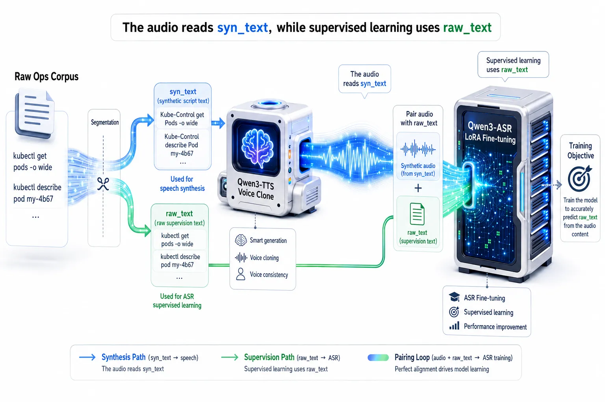
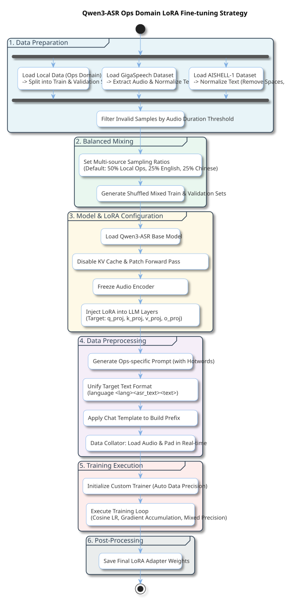

To improve K8S voice command recognition accuracy, and reduce the rate of misrecognition that generic ASR models often suffer in SRE scenarios due to their lack of domain-specific priors for terms like kubectl and ConfigMap.

This post describes how we synthesized domain-specific voice samples, combined text decoupling with a balanced replay strategy for LoRA fine-tuning, and reduced the OPS domain CER from roughly 24% down to roughly 6%, while largely preserving the model's general-purpose recognition capability.

---

# Qwen3-ASR Based K8S Voice Command Recognition Enhancement: An Initial Exploration

Most engineers have been through something like this. You're rushing to catch a train, bag in tow, ready to actually enjoy a holiday for once.

Then it hits — that alert tone you know all too well and never want to hear, cutting right through the crowd: "[P0 ALERT] Core transaction service response timeout!"

To help engineers handle production issues from wherever they are, Chaterm built a mobile SRE version of Claude Code powered by Qwen3-ASR.

To make that work, we adapted **Qwen3-ASR** (Alibaba's latest open-source speech model, available in 1.7B and 0.6B sizes), paired it with **Qwen3-TTS** to build synthetic training data, and used **LoRA** fine-tuning for domain adaptation. This wasn't a simple model swap -- it was **an initial end-to-end exploration from data construction to model fine-tuning**.

Today we'll share how we tried to take an open-source ASR model from "aced the Mandarin listening exam" and nudge it toward "actually understands ops context."

---

## 01 The Pain of SRE ASR: It's Not That It Can't Hear -- It's That It Gets It Wrong

### 1.1 Why Does Generic ASR Keep Failing in SRE Scenarios?

Generic speech recognition's biggest enemy isn't background noise -- it's the **domain gap**.

When you say "kubectl," the model has no concept of it, so it just force-matches to words it does know:

| What You Said    | What It Heard                                     | Consequence                          |
| ---------------- | ------------------------------------------------- | ------------------------------------ |
| `kubectl`        | "cube control" / "Q-control" / "kool-bu-control" | Main command completely unrecognized |
| `ConfigMap`      | "config map" / "config diagram"                   | Resource type misidentified          |
| `Liveness Probe` | "liveness proh-boo" / "alive probe"               | Health check config mangled          |
| `yaml`           | "yarn" / "yam-l" / "ya-ml"                       | Config file format broken            |

**The core tension**: casual conversation can tolerate "close enough," but SRE commands need to be precise. That's why the classic "hot-word list + post-processing" approach tends to hit a ceiling when dealing with connected speech, accents, mixed Chinese-English, and symbol-heavy parameters like `-n` or `/`.

So we tried something else: giving Qwen3-ASR a bit of "ear surgery" -- **LoRA fine-tuning**.

---

## 02 You Can't Make Bricks Without Straw: No Data? We Made Our Own.

### 2.1 Real SRE Voice Data Is Hard to Come By

Fine-tuning a model means first solving the question of "where does the training data come from?" Real SRE voice data is both hard to obtain and privacy-sensitive. So we took a different approach: **using Qwen3-TTS's In-Context Learning (ICL) voice cloning capability to let AI teach itself**.

Think of it like having the top student record themselves reading the textbook aloud, then using those recordings as listening practice material for everyone else.

**On the text corpus side**, we prepared roughly 8,000 raw text samples, split roughly 50/50: half were K8S/Linux command sentences generated by an LLM, and half were descriptive passages extracted from OPS-domain e-books. Mixing these two types means the training data covers both "command-style short sentences" and "descriptive long sentences" -- we hoped this would push the model's generalization boundary.

**On the acoustic side**, we had **3 male and 2 female** speakers record base voice profiles (Basic Voices) in quiet, everyday environments using mobile phone microphones. We deliberately kept mild natural accents to improve acoustic robustness. To prevent the model from overfitting to specific voice-vocabulary pairings, each Basic Voice was used to synthesize only a random 75% sample of the full corpus. In total, we built roughly **30,000** synthetic voice samples.

### 2.2 The Trickiest Part: Text Decoupling System

Feeding raw SRE text directly into TTS causes severe **G2P (grapheme-to-phoneme) breakdown**. It can't pronounce `kubectl` right, and it chokes on special symbols.

To address this, we designed a **text decoupling architecture**:

- **raw_text (supervision label)**: The canonical text we want the ASR to output -- the commands as we'd normally type them.
- **syn_text (pronunciation text)**: A "secret dialect" fed exclusively to TTS, tuned for acoustic generation quality.

**Core normalization rules:**
1. **Forced pronunciation mapping**: Convert unpronounceable terms into stable phonemes. For example, `kubectl` maps to `Kube-Control`, `mysql` maps to `My-Circle`.
2. **Spoken-language symbols and numbers**: `-` maps to `杠`, `/` maps to `斜杠`. Key detail: **all Arabic numerals are force-mapped to Chinese written-out equivalents**, bypassing the unpredictable behavior of TTS built-in number normalization.
3. **Sentence-ending acoustic protection**: This one we learned the hard way. Because of the TTS model's receptive field and silence-trimming mechanism, omitting terminal punctuation very often causes the last syllable to become muddled or get clipped entirely. So we **force-append `. ` (a space followed by a period) to every `syn_text`**.

*Pipeline example:*
> **Input (raw_text)**: `kubectl describe pod my-6b47`
> **TTS Prompt (syn_text)**: `Kube-Control describe Pod my dash sixb47 .`
> **ASR Supervision Label**: `language None<asr_text>kubectl describe pod my dash 6b47`

### 2.3 Voice Cloning: Embedding "Pronunciation Anchors" (Contextual Anchors)

Qwen3-TTS's advanced cloning goes beyond extracting a tonal fingerprint (x-vector) -- it also uses extracted Speech Codes as context. To make the cloned voices naturally "speak ops," we **deliberately packed the reference text scripts with dense clusters of terms like `Kubernetes`, `Nginx`, and `ConfigMap`**.

This appeared to provide **"pronunciation anchors"** that helped stabilize specialist term pronunciation during bulk synthesis. Of course, if a particular Basic Voice just couldn't get `systemctl` right no matter what, we'd trigger a fallback strategy -- dropping that term from their reference text to avoid poisoning the context.

---

## 03 Training Strategy: Stay Specialized Without Forgetting Your Roots

### 3.1 Architectural Decoupling: Touch the "Brain," Leave the "Ears" Alone

Qwen3-ASR uses a clean decoupled architecture: **Whisper-like Encoder + LLM Decoder**. The underlying LLM brings strong contextual understanding and mixed Chinese-English processing capability out of the box.

In SRE scenarios, misrecognition isn't fundamentally an "ears" problem -- it's a "brain" problem. The decoding stage assigns skewed prior probabilities to domain-specific vocabulary.

So our LoRA strategy was deliberately conservative:
**Fully freeze the `audio_tower` (acoustic encoder), and inject LoRA only into the Attention modules (`q_proj`, `k_proj`, `v_proj`, `o_proj`) of the `thinker` (LLM) layer.**

This not only significantly reduced VRAM consumption -- it preserved the general-purpose acoustic feature extraction that the pretrained model built up over tens of millions of hours of data. The encoder is already strong enough; the root cause of OPS misrecognition lies on the decoding side. In our experiments, targeting LoRA injection at the decoder layer yielded relatively better results.

### 3.2 Data Mix Ratio (Data Mixture)

Training exclusively on SRE data makes **catastrophic forgetting** almost inevitable. The model would turn into a one-trick pony -- great at hearing commands and nothing else.

We used a **balanced replay strategy**:
- **50% in-house SRE synthetic data** (drives domain adaptation)
- **25% GigaSpeech** (maintains English baseline capability)
- **25% AISHELL-1** (maintains Chinese baseline capability)

The goal was for the model to learn `kubectl` while still holding on to its general-purpose speech capability.

---

## 04 Results: Initial Improvement in Domain Recognition Accuracy

### 4.1 Evaluation

To prevent "open-book testing" (data leakage), our domain test set was generated entirely from **Basic Voices not seen during training**, with text content strictly isolated from the training set. Given the mixed Chinese-English context, both WER (Word Error Rate) and CER (Character Error Rate) were treated as core metrics.

| Model Config                  | GigaSpeech Test (WER/CER) | Aishell-1 Test (WER/CER) | In-house OPS Domain Test (WER/CER) |
| :---------------------------- | :------------------------ | :----------------------- | :--------------------------------- |
| **Qwen3-ASR-1.7B Base**       | 10.08% / 4.63%            | 0.86% / 1.54%            | 21.78% / 24.54%                    |
| **Qwen3-ASR-0.6B Base**       | 10.86% / 5.01%            | 1.16% / 2.09%            | 22.14% / 23.38%                    |
| **1.7B LoRA (this work)**     | **9.79% / 4.34%**         | 1.03% / 1.84%            | **4.44% / 5.61%** ✅                |
| **0.6B LoRA (this work)**     | 11.63% / 4.84%            | 1.36% / 2.44%            | 4.96% / 6.27% ✅                   |

**Takeaway**: On our test set, the 1.7B LoRA approach reduced OPS domain CER from 24.54% to 5.61% -- a relative drop of over 75%. General capability on GigaSpeech and Aishell-1 shifted only modestly, and these initial results suggest the balanced replay strategy did suppress catastrophic forgetting to some extent. The 0.6B version also brought OPS domain CER down from 23.38% to 6.27%, offering a promising reference path for resource-constrained mobile deployment.

### 4.2 Real-World Scenario Analysis

| Ground Truth (Expected Output)              | Before Fine-tuning                         | After Fine-tuning                             | What Got Fixed                                    |
| :------------------------------------------ | :----------------------------------------- | :-------------------------------------------- | :------------------------------------------------ |
| `kubectl apply` command                     | Q, Control, Apply, Command                 | `kubectl apply` command ✅                     | Fixed letter-by-letter splitting of English terms |
| Resource objects like `Service` `ConfigMap` | Resource objects, like service, config map | Resource objects like `Service` `ConfigMap` ✅ | Restored standard CamelCase and no-space forms    |
| New version of `yaml`                       | New version of yarn                        | New version of `yaml` ✅                       | Corrected prior bias toward sound-alike words     |

---

## 05 The Engineering Philosophy Behind the Technical Choices

This fine-tuning run gave us a few concrete takeaways:

1️⃣ **ASR domain enhancement is a systems problem**
It's not just tweaking a parameter and calling it done. The full pipeline deserves attention -- from text normalization rules and sentence-ending handling all the way down to Attention-layer fine-tuning.

2️⃣ **Decoupling helps keep adaptation costs low**
Decouple pronunciation text from supervision labels. Decouple the acoustic encoder from the language model decoder. Lean on the pretrained model's existing general capability as much as possible, then apply targeted domain bias on top.

---

## 06 Closing Thoughts and Work Still Ahead

The real value of voice recognition in SRE isn't "fewer keystrokes" -- it's **"having the confidence to delegate at critical moments."** When you're half-asleep and can delete a crashing Pod with a single sentence, that certainty makes a real difference.

Of course, this isn't the end of the road. There are still some things we're working through:

1) **Glitching caused by synthetic data contamination**: The current pipeline lacks systematic human review or ASR cross-validation-based automatic filtering. TTS synthesis naturally produces dirty data -- stuttering, repetition, word-clipping -- and some of that found its way into the training set. The result is that the fine-tuned model occasionally goes into broken-record mode or hallucinates on certain audio inputs. The next step is to build in automatic cross-validation filtering.

2) **Structural imbalance for purely English long-form sentences**: Even with GigaSpeech in the mix, Chinese still dominates in terms of overall token share. There's room to improve generalization for complex, English-only commands.

3) **Coming soon -- Prompt Biasing (contextual hot-word biasing)**: The ASR model already exposes a Prompt interface, but we didn't fully use it in this experiment. The plan is to inject real-time K8S context resource names (like dynamically generated Pod Names such as `my-nginx-84b8d7`) into the system Prompt, with the hope of achieving better **on-the-fly OOV recall**.
